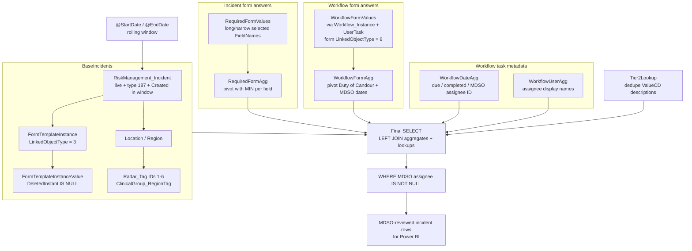
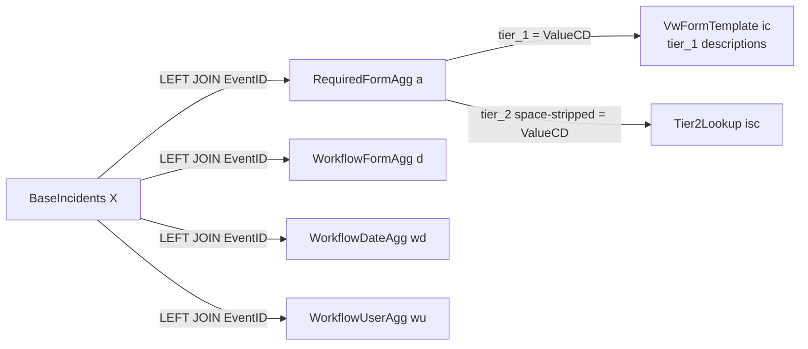

# GDW_query.sql — How it works

Companion documentation for [`GDW_query.sql`](GDW_query.sql). That script extracts **live LFPSE incidents** (Radar incident type `187`) from the Workforce / Radar schema into a **flat, one-row-per-incident** dataset for Power BI (or similar reporting tools), limited to incidents that have an assigned **MDSO Team Incident Review (LFPSE)** workflow task.

## Purpose

| Goal | How the query delivers it |
| --- | --- |
| Report on recent LFPSE incidents | Filter `Created` to a rolling window (default last 3 months through today) |
| One row per incident | `SELECT DISTINCT` on the base set + `GROUP BY EventID` pivots |
| Enrich with form answers | Incident-form fields + workflow-task form fields (Duty of Candour, MDSO dates) |
| Enrich with process timing | Due / completed dates and assignees for named workflow tasks |
| Focus on MDSO-reviewed work | Final `WHERE` requires `MDSOTeamIncidentReview_AssignedTo IS NOT NULL` |

## Grain and result shape

- **Expected grain:** one returned row per `EventID` (incident).
- **Not returned:** incidents outside the date window; non-live records; non-187 types; incidents that fail the base INNER JOINs (no form instance / no clinical-group tag); incidents with no MDSO review assignee.

## High-level data flow



## CTE reference

### Parameters

```sql
DECLARE @StartDate DATE = DATEADD(MONTH, -3, CAST(GETDATE() AS DATE));
DECLARE @EndDate   DATE = CAST(GETDATE() AS DATE);
```

Every CTE filters with:

```sql
inc.[Created] >= @StartDate
AND inc.[Created] < DATEADD(DAY, 1, @EndDate)
```

Using `< @EndDate + 1 day` includes all of today regardless of time-of-day on `Created`.

To change the lookback, edit the `-3` in `@StartDate` (months).

### `BaseIncidents`

Builds the **spine** of the extract: event id, Radar URL, reference, title, dates, location, region, and clinical-group region tag.

| Join / filter | Effect |
| --- | --- |
| `INNER JOIN` form instance (`LinkedObjectType = 3`) + non-deleted values | Incident must have at least one live form answer |
| `LEFT JOIN` location → region → tag link | Location/region optional until the tag join |
| `INNER JOIN` `Radar_Tag` with `tg.ID IN (1,2,3,4,5,6)` | Region must carry one of these clinical-group tags |
| `RecordStatus = '2'` | Live records only |
| `IncidentTypeId = 187` | LFPSE / incident type for this report |

**Caveat:** the INNER JOINs mean incidents without a matching form instance or without tags 1–6 never enter the result set, even if they later have an MDSO assignee.

### `RequiredFormValues` → `RequiredFormAgg`

1. Pull selected **incident-form** field names into a long table (`EventID`, `FieldName`, `Value`).
2. Pivot to wide columns with conditional `MIN(...)`.

Fields extracted:

| FieldName | Final column alias (approx.) |
| --- | --- |
| `Patient_Involved` | DoesThisEventInvolveAPatient |
| `LFPSE_Patient_Involved` | DidIncidentOccurToPatientUnderTrustCare |
| `staff_related` | …HarmToStaff |
| `environment_related` | …EstatesFacilitiesOrTheEnvironment |
| `visitors_related` | …VisitorsMembersOfThePublicRelatives |
| `tier_1` / `tier_2` | Used for classification lookups |

### `WorkflowFormValues` → `WorkflowFormAgg`

Same long → pivot pattern, but values come from forms attached to **workflow user tasks**:

```text
Incident
  → Workflow_Instance (LinkedObjectType = 3)
    → Workflow_UserTask
      → FormTemplateInstance (LinkedObjectType = 6)
        → FormTemplateInstanceValue
```

Includes Duty of Candour questions and MDSO investigation start/end field codes:

- `sXRWExCBXMwFClfp_start-of-mdso-investigation` → `StartDateOfMDSOReview`
- `o2WJulzEqABvEMOG_end-of-mdso-investigation` → `EndDateOfMDSOReview`

If Radar form field codes change, update both the `IN (...)` list and the matching `MIN(CASE ...)` expressions.

### `WorkflowDateAgg`

For each incident with a workflow instance, aggregates due/completion dates for:

- Governance Triage  
- Local Incident Review  
- MDSO Team Incident Review (LFPSE)  

Also captures `AssignedToUserId` for the MDSO task (`MDSOTeamIncidentReview_AssignedTo`), which drives the final filter.

### `WorkflowUserAgg`

Same three tasks, joining `Radar_User` for assignee **display names** (Governance Triage and Local Incident Review are selected in the final output; the MDSO display-name column exists in the CTE but is not projected in the final `SELECT`).

### `Tier2Lookup`

From `rad.VwFormTemplate`, maps `tier_2` **codes** (`ValueCD`) to **descriptions** (`ValueDSC`), preferring the newer `LFPSE Incident Form` over `LFPSE (NHS Event Version 5.6 and GSTT Option 3)` when the same code appears in both (`ROW_NUMBER` / `rn = 1`).

## Final SELECT and joins



### Classification fallbacks

```sql
COALESCE(ic.ValueDSC, a.tier_1)   AS IncidentClassification
COALESCE(isc.ValueDSC, a.tier_2)  AS [IncidentSub-Classification]
```

If a code has no matching template description, the **raw form code** is returned. Collation is normalized with `COLLATE DATABASE_DEFAULT`. Tier 2 matching also strips spaces on both sides for robustness.

### MDSO filter

```sql
WHERE wd.[MDSOTeamIncidentReview_AssignedTo] IS NOT NULL
```

Only incidents with a non-null MDSO review assignee ID are returned. This is the primary “MDSO reviewed / in MDSO queue” gate for the extract.

## Output column groups

1. **Identity & narrative:** `EventID`, `EventURL`, `EventType`, `EventSubType`, `Reference`, `Title`, dates, location, region, clinical group  
2. **Classification:** `IncidentClassification`, `IncidentSub-Classification`  
3. **Harm / involvement flags:** patient, staff, environment, visitors  
4. **Duty of Candour:** indication, reasons, verbal apology, letter, outcome sharing (+ dates)  
5. **Workflow process:** Governance Triage and Local Incident Review due/completed dates and users  
6. **MDSO process:** MDSO due/completed dates, assignee ID, start/end of MDSO review from workflow forms  

## Important behavioural caveats

1. **INNER JOINs shrink the base set.** Missing form values or missing tags 1–6 exclude the incident entirely before LEFT JOINs can enrich it.  
2. **`MIN` is not “latest.”** When multiple answers or task rows exist for the same field/task, `MIN` picks a deterministic value (lexicographic / chronological depending on type), not necessarily the most recent edit.  
3. **MDSO assignment is mandatory** in the final result; unassigned MDSO tasks (or no MDSO task) drop out.  
4. **Soft-deleted form answers** (`DeletedInstant IS NOT NULL`) are ignored.  
5. **LinkedObjectType meanings used here:** `3` = incident; `6` = workflow user task (as used by this query’s joins).  
6. **Field name codes** (especially the hashed Duty of Candour / MDSO keys) are form-definition dependent; confirm in Radar if forms are republished.

## How to maintain

| Change needed | Where to edit |
| --- | --- |
| Longer/shorter history | `@StartDate` month offset |
| Different incident type | All `IncidentTypeId = 187` predicates (keep consistent) |
| More/fewer region tags | `tg.ID IN (1,2,3,4,5,6)` in `BaseIncidents` |
| Extra incident-form fields | `RequiredFormValues` `IN` list + `RequiredFormAgg` pivot + final `SELECT` |
| Extra workflow-form fields | `WorkflowFormValues` / `WorkflowFormAgg` + final `SELECT` |
| Extra workflow tasks | `WorkflowDateAgg` / `WorkflowUserAgg` task description lists + final columns |
| Include non-MDSO incidents | Remove or relax the final `WHERE` on `MDSOTeamIncidentReview_AssignedTo` |
| Prefer different tier_2 template | Ordering in `Tier2Lookup` `ROW_NUMBER` |

## Related files

- [`GDW_query.sql`](GDW_query.sql) — executable extract (inline comments mirror this guide)  
- [`python_analysis.ipynb`](python_analysis.ipynb) — optional downstream analysis notebook in this repo  
