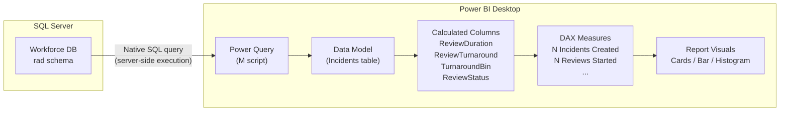
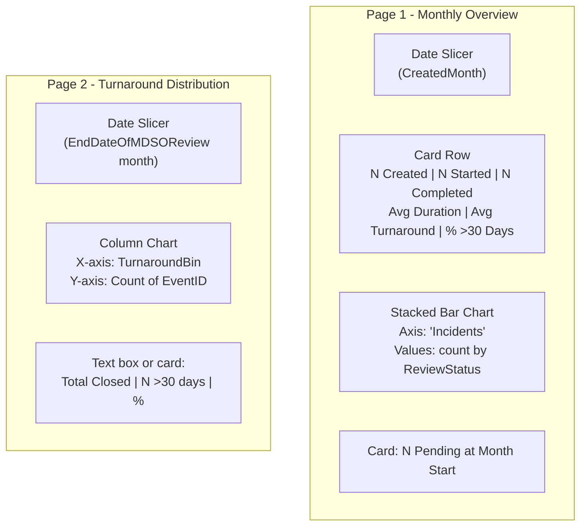

# Migrating MDSO Incident Analysis from Python to Power BI

This guide walks through replicating the analysis in [`python_analysis.ipynb`](python_analysis.ipynb) inside Power BI Desktop, using [`GDW_query.sql`](GDW_query.sql) as the live data source.

## Prerequisites

- Power BI Desktop (latest version)
- Network access to the SQL Server hosting the `Workforce` database
- Windows authentication or a SQL login with read access to the `rad` schema
- The files in this repo:
  - [`PowerBI_query.pq`](PowerBI_query.pq) - Power Query M connection script
  - [`PowerBI_measures.dax`](PowerBI_measures.dax) - DAX calculated columns and measures

## What the Python notebook does (and what we replicate)

| # | Python analysis | Power BI equivalent |
|---|---|---|
| 1 | Incidents created in the current month: counts, averages, stacked status bar | Card visuals + stacked bar chart driven by DAX measures |
| 2 | Incidents pending review close at start of month | Card visual with `N Pending at Month Start` measure |
| 3 | Turnaround distribution for prior month (histogram with 30+ day highlight) | Column chart on `TurnaroundBin` calculated column |

## Architecture overview



## Step 1 - Connect to the data source

1. Open Power BI Desktop.
2. Go to **Home > Transform Data** to open Power Query Editor.
3. Click **Advanced Editor**.
4. Paste the contents of [`PowerBI_query.pq`](PowerBI_query.pq).
5. Replace `"YOUR_SERVER_NAME"` with your actual SQL Server hostname (e.g. `"sqlserver01.trust.nhs.uk"`).
6. Click **Done**, then **Close & Apply**.

Power Query sends the full SQL statement to the server via `Sql.Database(...)` with the `[Query = ...]` option. The rolling 3-month date window is computed server-side (no Power Query date filtering needed).

### Key notes on the connection

- The `USE [Workforce]` / `GO` / `SET` preamble from `GDW_query.sql` is stripped because Power Query specifies the database in the connection string.
- Column types for dates are forced to `type datetime` or `type date` in the final Power Query step. This ensures the DAX `DATEDIFF` functions work without casting.
- `StartDateOfMDSOReview` and `EndDateOfMDSOReview` are stored as text in Radar forms; they arrive as text from the SQL. The Power Query step types them as `type date`. If parsing errors appear, add a `try ... otherwise null` step for those columns.

## Step 2 - Add calculated columns

Select the **Incidents** table in the model view, then add each column below via **Modeling > New Column**.

### ReviewDuration

```dax
ReviewDuration =
IF(
    NOT ISBLANK( Incidents[StartDateOfMDSOReview] )
        && NOT ISBLANK( Incidents[EndDateOfMDSOReview] ),
    DATEDIFF( Incidents[StartDateOfMDSOReview], Incidents[EndDateOfMDSOReview], DAY ),
    BLANK()
)
```

Equivalent to the Python: `ReviewEndDate - ReviewStartDate` (in days).

### ReviewTurnaround

```dax
ReviewTurnaround =
IF(
    NOT ISBLANK( Incidents[CreatedDate] )
        && NOT ISBLANK( Incidents[EndDateOfMDSOReview] ),
    DATEDIFF( Incidents[CreatedDate], Incidents[EndDateOfMDSOReview], DAY ),
    BLANK()
)
```

Equivalent to the Python: `ReviewEndDate - EventCreatedDate` (in days).

### TurnaroundBin

```dax
TurnaroundBin =
VAR _days = Incidents[ReviewTurnaround]
RETURN
    SWITCH(
        TRUE(),
        ISBLANK( _days ), BLANK(),
        _days <= 4,  "0-4",
        _days <= 9,  "5-9",
        _days <= 14, "10-14",
        _days <= 19, "15-19",
        _days <= 24, "20-24",
        _days <= 29, "25-29",
        "30+"
    )
```

Replicates the Python `pd.cut` bins: `[-1, 4, 9, 14, 19, 24, 29, inf]`.

### TurnaroundBinSort

```dax
TurnaroundBinSort =
VAR _days = Incidents[ReviewTurnaround]
RETURN
    SWITCH(
        TRUE(),
        ISBLANK( _days ), BLANK(),
        _days <= 4,  1,
        _days <= 9,  2,
        _days <= 14, 3,
        _days <= 19, 4,
        _days <= 24, 5,
        _days <= 29, 6,
        7
    )
```

After adding, select `TurnaroundBin` in the Fields pane, then **Column tools > Sort by Column > TurnaroundBinSort**. This ensures the histogram axis is ordered numerically.

### ReviewStatus

```dax
ReviewStatus =
SWITCH(
    TRUE(),
    NOT ISBLANK( Incidents[EndDateOfMDSOReview] ), "Review Completed",
    NOT ISBLANK( Incidents[StartDateOfMDSOReview] ), "Review In Progress",
    "Review Not Started"
)
```

Matches the three Python segments: `completed_count`, `started_not_completed_count`, `created_not_started_count`.

### ReviewStatusSort

```dax
ReviewStatusSort =
SWITCH(
    Incidents[ReviewStatus],
    "Review Completed", 1,
    "Review In Progress", 2,
    "Review Not Started", 3
)
```

Sort `ReviewStatus` by this column (same technique as above).

### CreatedMonth

```dax
CreatedMonth =
EOMONTH( Incidents[CreatedDate], -1 ) + 1
```

The first day of the creation month - used as a slicer dimension and for the "pending at month start" measure.

## Step 3 - Add measures

Add each via **Modeling > New Measure**.

### N Incidents Created

```dax
N Incidents Created = COUNTROWS( Incidents )
```

### N Reviews Started

```dax
N Reviews Started =
CALCULATE(
    COUNTROWS( Incidents ),
    NOT ISBLANK( Incidents[StartDateOfMDSOReview] )
)
```

### N Reviews Completed

```dax
N Reviews Completed =
CALCULATE(
    COUNTROWS( Incidents ),
    NOT ISBLANK( Incidents[EndDateOfMDSOReview] )
)
```

### Avg Review Duration (Days)

```dax
Avg Review Duration (Days) = AVERAGE( Incidents[ReviewDuration] )
```

### Avg Turnaround (Days)

```dax
Avg Turnaround (Days) = AVERAGE( Incidents[ReviewTurnaround] )
```

### % Turnaround > 30 Days

```dax
% Turnaround > 30 Days =
VAR _completed =
    CALCULATE(
        COUNTROWS( Incidents ),
        NOT ISBLANK( Incidents[ReviewTurnaround] )
    )
VAR _over30 =
    CALCULATE(
        COUNTROWS( Incidents ),
        Incidents[ReviewTurnaround] > 30
    )
RETURN
    IF( _completed > 0, DIVIDE( _over30, _completed ), BLANK() )
```

Format this measure as **Percentage** in the Formatting pane.

### N Pending at Month Start

```dax
N Pending at Month Start =
VAR _selectedMonth =
    IF(
        HASONEVALUE( Incidents[CreatedMonth] ),
        VALUES( Incidents[CreatedMonth] ),
        DATE( YEAR( TODAY() ), MONTH( TODAY() ), 1 )
    )
RETURN
    CALCULATE(
        COUNTROWS( Incidents ),
        ALL( Incidents ),
        Incidents[CreatedDate] < _selectedMonth,
        OR(
            Incidents[EndDateOfMDSOReview] >= _selectedMonth,
            ISBLANK( Incidents[EndDateOfMDSOReview] )
        )
    )
```

This replicates the Python logic:
- `EventCreatedDate <= date_beginning`
- AND (`ReviewEndDate > date_beginning` OR `ReviewEndDate` is null)

### % Short Turnaround (< 3 days)

```dax
% Short Turnaround =
VAR _completed =
    CALCULATE(
        COUNTROWS( Incidents ),
        NOT ISBLANK( Incidents[ReviewTurnaround] )
    )
VAR _short =
    CALCULATE(
        COUNTROWS( Incidents ),
        Incidents[ReviewTurnaround] < 3
    )
RETURN
    IF( _completed > 0, DIVIDE( _short, _completed ), BLANK() )
```

## Step 4 - Build the report visuals

### Suggested page layout



### 4a. Date slicer

1. Insert a **Slicer** visual.
2. Drag `CreatedMonth` into the slicer field.
3. Set display to **Dropdown** or **List** (month names).
4. This slicer drives all measures on Page 1.

### 4b. KPI cards

Insert six **Card** visuals across the top, each bound to one measure:

| Card | Measure | Format |
|------|---------|--------|
| 1 | `N Incidents Created` | Whole number |
| 2 | `N Reviews Started` | Whole number |
| 3 | `N Reviews Completed` | Whole number |
| 4 | `Avg Review Duration (Days)` | 1 decimal |
| 5 | `Avg Turnaround (Days)` | 1 decimal |
| 6 | `% Turnaround > 30 Days` | Percentage |

### 4c. Stacked bar chart (status breakdown)

This replicates the Python `plt.bar` stacked chart.

1. Insert a **Stacked Bar Chart**.
2. Y-axis: set to a static label (e.g. a constant column or leave as default).
3. X-axis (Value): `N Incidents Created` (count of rows).
4. Legend: `ReviewStatus`.
5. In **Format > Data colors**, assign:
   - Review Completed: green (`#66c2a5`)
   - Review In Progress: orange (`#fc8d62`)
   - Review Not Started: blue (`#8da0cb`)

Alternatively, use a **100% Stacked Bar Chart** for proportional view.

### 4d. Turnaround histogram (Page 2)

This replicates the Python Seaborn `countplot`.

1. Insert a **Clustered Column Chart**.
2. X-axis: `TurnaroundBin`.
3. Y-axis: Count of `EventID` (or use a measure `COUNTROWS(Incidents)`).
4. For the "30+" bar to appear in a different colour:
   - Use **Conditional formatting** on the data colours with a rule: if `TurnaroundBin` = "30+" then crimson, else steelblue.
5. Add a separate **Card** showing `% Turnaround > 30 Days` next to the chart.
6. Filter this page to a specific month's `EndDateOfMDSOReview` via a page-level slicer on the review end date month.

### 4e. Pending at month start card

1. Insert a **Card** visual.
2. Bind to `N Pending at Month Start`.
3. Place below or beside the stacked bar on Page 1.

## Step 5 - Refresh and parameterise

### Changing the lookback period

The 3-month window is set server-side in the SQL. To adjust:

1. Open Power Query Editor (Transform Data).
2. In the `SqlQuery` text, find `DATEADD(MONTH, -3, ...)`.
3. Change `-3` to your desired months (e.g. `-6` for 6 months).
4. Click **Close & Apply**.

### Scheduling refresh

If published to Power BI Service:

1. Navigate to the dataset settings.
2. Under **Gateway connection**, map to your on-premises data gateway that has access to the SQL Server.
3. Set a **Scheduled refresh** (e.g. daily at 6 AM).

### Making the month parameter dynamic

To avoid editing the M script manually, you can create a **Power Query parameter**:

1. In Power Query: **Home > Manage Parameters > New Parameter**.
2. Name: `LookbackMonths`, Type: Number, Default: 3.
3. Replace the `-3` in the SQL text with: `" & Text.From(-LookbackMonths) & "`.
4. The parameter will appear in the published dataset settings for non-technical users to adjust.

## Mapping: Python code to Power BI

| Python code | Power BI equivalent |
|---|---|
| `pd.read_csv('data.csv')` | Power Query native SQL via `Sql.Database(...)` |
| `pd.to_datetime(...)` date construction | Not needed: SQL returns proper dates |
| `df['ReviewDuration'] = EndDate - StartDate` | Calculated column `ReviewDuration` |
| `df['ReviewTurnaroundSinceEventCreated']` | Calculated column `ReviewTurnaround` |
| `len(df_created_post_start_of_month)` | Measure `N Incidents Created` (filtered by slicer) |
| `len(df[df['ReviewStartDate'].notna()])` | Measure `N Reviews Started` |
| `len(df[df['ReviewEndDate'].notna()])` | Measure `N Reviews Completed` |
| `df['ReviewDuration'].mean()` | Measure `Avg Review Duration (Days)` |
| `df['ReviewTurnaroundSinceEventCreated'].mean()` | Measure `Avg Turnaround (Days)` |
| `n_long_turnaround / len(df_filtered)` | Measure `% Turnaround > 30 Days` |
| `pd.cut(..., bins)` | Calculated column `TurnaroundBin` |
| `sns.countplot(x="TurnaroundBin")` | Clustered Column Chart on TurnaroundBin |
| Stacked `plt.bar(...)` | Stacked Bar Chart on ReviewStatus |
| `n_unclosed_as_of_start_of_month` | Measure `N Pending at Month Start` |

## Advantages over the Python approach

- **Live data**: refreshes automatically from the database; no CSV export step.
- **Dynamic filtering**: date slicers replace hardcoded month variables.
- **Self-service**: non-technical users can interact without writing code.
- **Shareable**: publish to Power BI Service for organisation-wide access.
- **Drill-through**: click a bar segment to see the underlying incidents.

## Troubleshooting

| Issue | Fix |
|---|---|
| Date columns show as text | Check the Power Query type step; add `try Date.From(...) otherwise null` for `StartDateOfMDSOReview` / `EndDateOfMDSOReview` |
| No data returned | Verify server name, ensure gateway is running, check the 3-month window covers your data |
| `TurnaroundBin` axis out of order | Confirm Sort-by-Column is set: select `TurnaroundBin` > Column tools > Sort by Column > `TurnaroundBinSort` |
| Measure returns BLANK for "N Pending" | Ensure a single month is selected in the slicer (measure requires `HASONEVALUE`) |
| Authentication error | Check Windows auth or provide SQL credentials in the data source settings |
